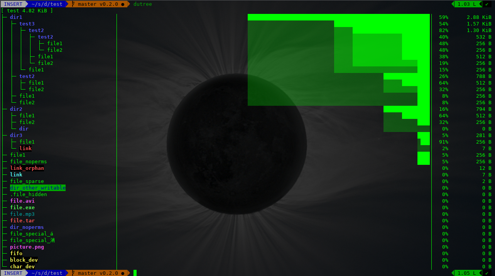

# dutree
a tool to analyze file system usage written in Rust



# Features

 - coloured output, according to the LS_COLORS  environment variable.
 - display the file system tree
 - ability to aggregate small files
 - ability to exclude files or directories
 - ability to compare different directories
 - fast, written in Rust

# Usage

```
 $ dutree --help
Usage: dutree [options] <path> [<path>..]

Options:
    -d, --depth [DEPTH] show directories up to depth N (def 1)
    -a, --aggr [N[KMG]] aggregate smaller than N B/KiB/MiB/GiB (def 1M)
    -s, --summary       equivalent to -da, or -d1 -a1M
    -u, --usage         report real disk usage instead of file size
    -b, --bytes         print sizes in bytes
    -f, --files-only    skip directories for a fast local overview
    -x, --exclude NAME  exclude matching files or directories
    -H, --no-hidden     exclude hidden files
    -A, --ascii         ASCII characters only, no colors
    -h, --help          show help
    -v, --version       print version number
```

# Installation

```
cargo install dutree
```

More details at [ownyourbits.com](https://ownyourbits.com/2018/03/25/analize-disk-usage-with-dutree)
